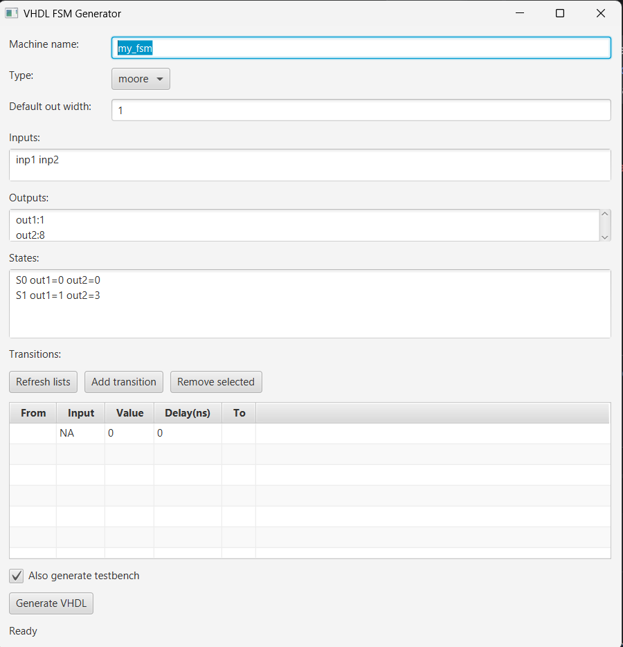

# VHDL FSM Generator (JavaFX)

Generates a simple **Moore** finite state machine (FSM) VHDL file (and an optional VHDL testbench) from a small GUI editor.

## Requirements

- JDK (project currently compiles with `javac 25`)
- JavaFX (if your JDK doesn’t bundle it, you need the JavaFX SDK installed)

## Build

From the repo root:

```powershell
javac src/*.java
```

## Run (GUI)

```powershell
java -cp src MachineViewer my_output_name
```

Or use the helper script (Windows):

```powershell
.\run.ps1 my_output_name
```

Or (cmd):

```bat
run.bat my_output_name
```

Outputs are written to the repo root:

- `my_output_name.vhdl`
- `my_output_name_tb.vhdl` (if “Also generate testbench” is checked)

### If JavaFX is missing

If you see an error like “JavaFX runtime components are missing”, run with your JavaFX SDK path:

```powershell
$env:FX="C:\\path\\to\\javafx-sdk\\lib"
java --module-path $env:FX --add-modules javafx.controls -cp src MachineViewer my_output_name
```

The helper scripts also use `$env:FX` / `%FX%` if set.

## GUI Input Formats

### Inputs

Space-separated names (excluding `clk`/`rst` which are always added):

```
inp1 inp2 inp3
```

### Outputs (per-output width)

One per line as `name:width` (width optional; defaults to “Default out width”):

```
out1:1
out2:8
```

### States (Moore outputs per state)

One per line:

```
<stateName> out1=0 out2=3 ...
```

The first state is used as the idle/reset state.

### Transitions (table)

Use the transition table:

- `From` / `To`: state names
- `Input`: one of your inputs or `NA`
- `Value`: 0/1 (ignored when `Input=NA`)
- `Delay(ns)`: integer delay used in `after <n> ns`





Notes:

- “No transition” is acceptable (the state’s case branch emits `null;`).
- If a state has conditional transitions but no `else`, it defaults to “stay in state”.
